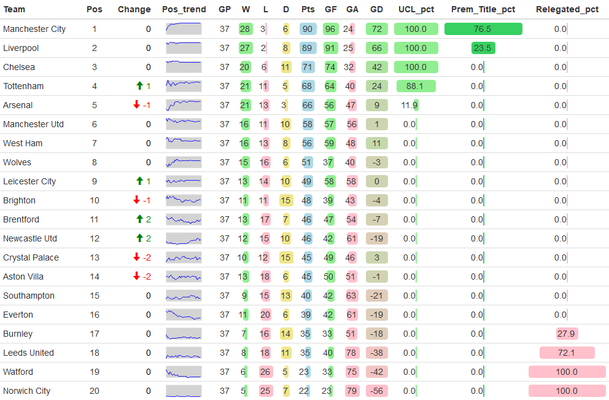
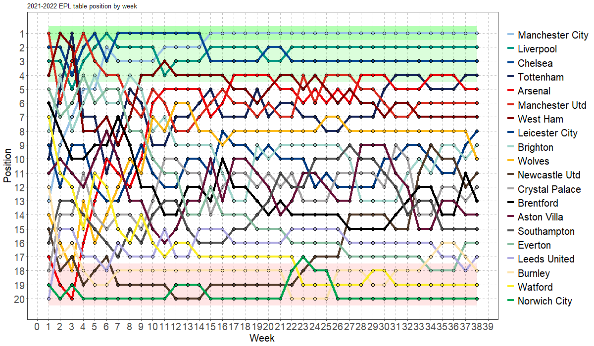
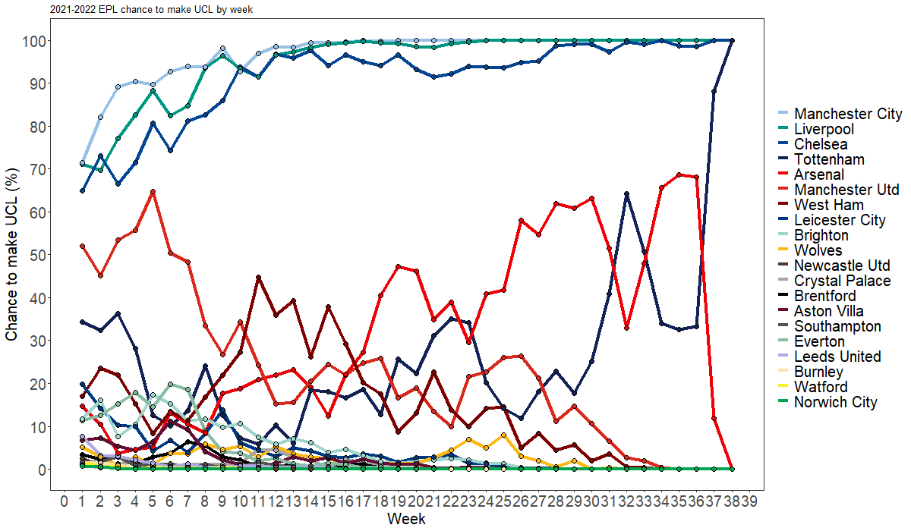
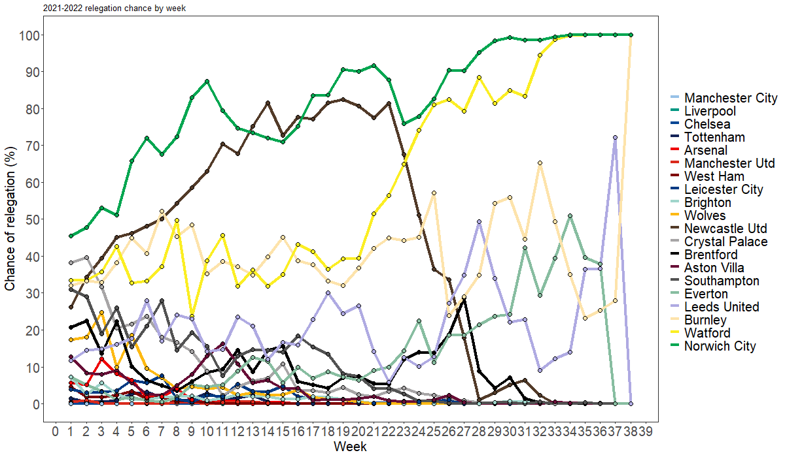
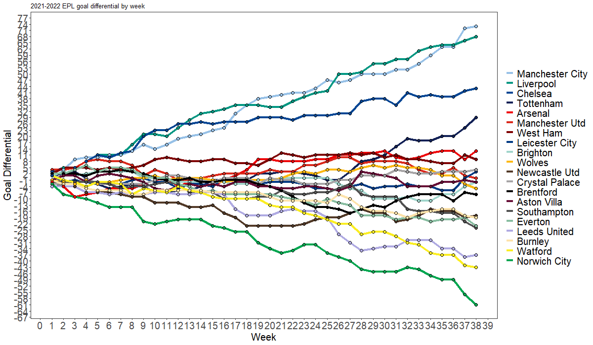
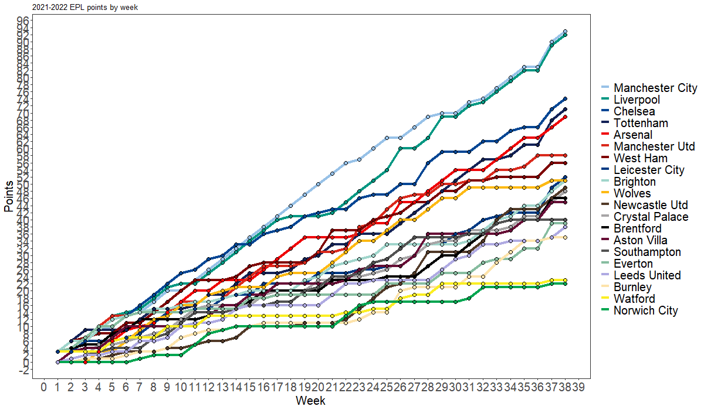
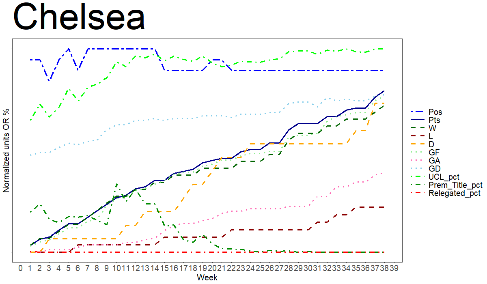

# EPL_2021-2022

## Example Output:

## Easiest way to run: 
* Ensure that all the files are in your working directory.
* Open "Run.R", highlight everything and run it.
* Enjoy  

## Sources 

SPI scores come from [fivethirtyeight](https://projects.fivethirtyeight.com/soccer-predictions/premier-league/)  

Scores and schedule come from [fbref](https://fbref.com/en/comps/9/schedule/Premier-League-Scores-and-Fixtures)  

Prediction model is based on the method by [fivethirtyeight](https://fivethirtyeight.com/methodology/how-our-club-soccer-predictions-work/)

